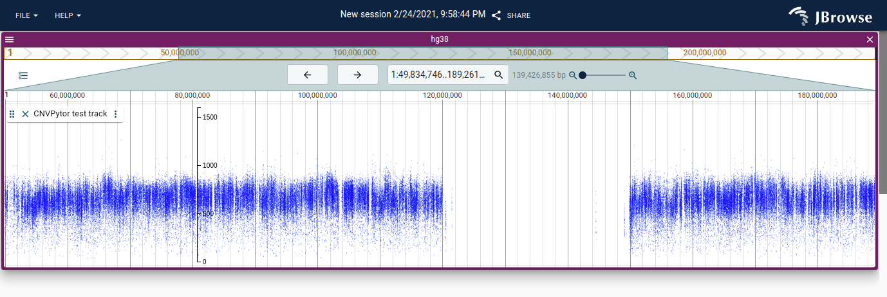

# `jbrowse-plugin-cnvpytor`

Allows for visualizing CNVPytor data

To run:

```
git clone https://github.com/GMOD/jbrowse-components
cd jbrowse-components
git checkout variant_plugin_exports
yarn
cd products/jbrowse-web
yarn start
```

Then in another shell

```
git clone https://github.com/cmdcolin/jbrowse-plugin-cnvpytor
cd jbrowse-plugin-cnvpytor
yarn
yarn start
```

Then visit

http://localhost:3000/?config=http://localhost:9000/config.json

Or with track already loaded

http://localhost:3000/?config=http%3A%2F%2Flocalhost%3A9000%2Fconfig.json&session=share-NzoxMKjW8L&password=qA6hS

This plugin is a work in progress with @arpanda

## Screenshot


